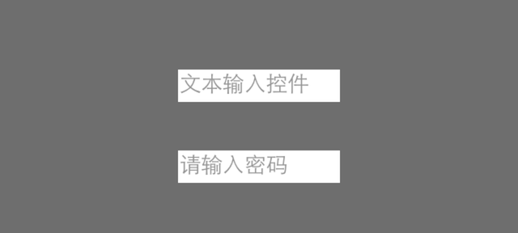

# 输入控件

输入控件如图：



游戏中，有时需要让玩家输入用户名、密码 或 聊天消息等，这时我们需要输入控件来完成这些功能。
输入控件内部调用手机系统提供的输入法接口，获取系统输入控件返回值，再传递给游戏引擎中对应的界面。

Quick 封装的输入控件类是 UIInput，源码位于`framework/cc/ui/UIInput.lua`。

示例代码:[UIInputTestScene.lua](./src/UIInputTestScene.lua)

## 创建输入控件

通过`cc.ui.UIInput.new(options)`新建一个输入控件。其中参数 options 是 table 类型，可选值如下：

- image: 输入框的图像，可以是图像名 或是 display.newScale9Sprite() 创建的 Sprite9Scale 对象。
- imagePressed: 输入状态时输入框显示的图像（可选）
- imageDisabled: 禁止状态时输入框显示的图像（可选）
- listener: 回调函数，监听输入事件（可选）
- size: 输入框的尺寸，用 cc.size(宽度, 高度) 创建
- x, y: 坐标（可选）

我们来看看如何简单的创建一个输入控件，在MainScene的ctor中加入下面代码

```lua
    local editbox = cc.ui.UIInput.new({
        image = "editbox.png", -- 输入控件的背景
        x = 200,
        y = 300,
        size = cc.size(200, 40)
    })
    self:addChild(editbox)
```

## 获取文本

可以使用`getText()`方法获取输入控件的文本内容。

```lua
local text = editbox:getText()
```

## 设置提示信息

你可以设置输入字段预期值的提示信息，该提示会在输入字段为空时显示，并会在字段获得焦点时消失。

假如输入框期望输入的是密码：

```lua
editbox:setPlaceHolder("请输入密码")
```

## 设置显示文本

你也可以给输入控件设置默认值。比如你想让玩家给游戏角色起名称，在输入框框中可以预留一个默认名字，用户可以偷懒不输入新名字，直接点击确认开始游戏。

```lua
editbox:setText("路人甲")
```

## 监听输入事件

在新建输入控件的时候，我们可以通过参数传递一个输入事件监听器给该控件，监听系统输入法在整个输入过程中的状态变化情况。

示例代码如下：

```lua
	-- 输入事件监听方法
    local function onEdit(event, editbox)
        if event == "began" then
        -- 开始输入
            print("开始输入")
        elseif event == "changed" then
        -- 输入框内容发生变化
            print("输入框内容发生变化")
            local text = editbox:getText()
            print(text)
        elseif event == "ended" then
        -- 输入结束
            print("输入结束")
        elseif event == "return" then
        -- 从输入框返回
            print("从输入框返回")
        end
    end

    local editbox = cc.ui.UIInput.new({
        image = "editbox.png", -- 输入控件的背景
        listener = onEdit, -- 绑定输入监听事件处理方法
        x = 200,
        y = 300,
        size = cc.size(200, 40)
    })
    editbox:addTo(self)
```

监听回调函数有两个参数

* event，事件类型。它有4个参数：
	* began，开始输入，并不是所有系统都产生这个事件。
		**Player模拟器上，不会有这个事件，只有changed事件**。
        iOS上，点击输入框，会弹出系统输入法界面，began事件产生。
	* changed，输入框内容发生变化。通常用来检测输入字符串长度以及合法性。
	* ended，输入结束。
	* return，从输入框返回。return 事件通常紧跟 ended 事件之后。我们点击手机键盘上的 return 按钮，或点击输入控件之外的地方，都会关闭输入框，触发这两个事件。一般地，我们可以在 return 事件中获取最终的字符串，并作界面切换。
* editbox，生产事件的输入框实例。

## 密码输入

在输入密码的时候，通常希望用\*来显示输入的文字。
我们可以通过`setInputFlag(0)`方法，来启动密码输入模式。

```lua
editbox:setInputFlag(0)
editbox:setPlaceHolder("请输入密码")
```